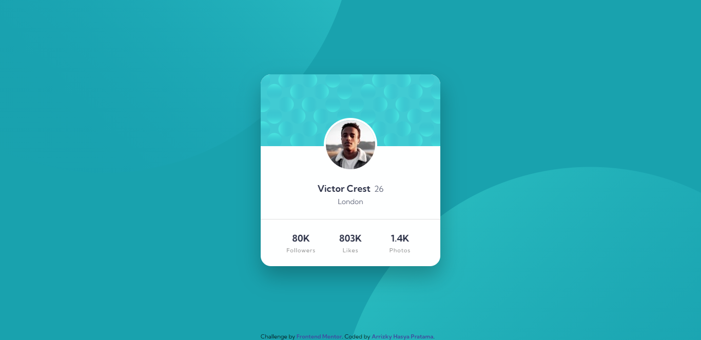

# Frontend Mentor - Profile card component solution

This is a solution to the [Profile card component challenge on Frontend Mentor](https://www.frontendmentor.io/challenges/profile-card-component-cfArpWshJ). Frontend Mentor challenges help you improve your coding skills by building realistic projects.

## Table of contents

- [Overview](#overview)
  - [The challenge](#the-challenge)
  - [Screenshot](#screenshot)
  - [Links](#links)
- [My process](#my-process)
  - [Built with](#built-with)
  - [What I learned](#what-i-learned)
- [Install](#install)
- [Author](#author)

## Overview

### The challenge

- Build out the project to the designs provided

### Screenshot


[📱 Mobile Version](./mobile.png)

### Links

- Solution URL: [Solution](https://github.com/arrizkyhp/profile-card-component-main)
- Live Site URL: [Live Site](https://arrizkyhp.github.io/profile-card-component-main/)

## My process

### Built with

- CSS custom properties
- Flexbox
- CSS Grid
- BEM naming
- [Sass](https://sass-lang.com/) - CSS extension
- [GulpJS](https://gulpjs.com/) - JS library
- [ReactJS](https://reactjs.org/) - JS library

### What I learned

In This challenge i learned that in react `<Link>` use to navigate around my application, so if you want to link go to another website use `<a>` instead.

The circle "Background" here i use default image, and i still dont know how to make it auro responsive:

```html
<div className="circle">
  
  
</div>
```

```scss
&__1,
&__2 {
  position: absolute;
  z-index: -1;
}

&__1 {
  top: -40rem;
  left: -18rem;
}
```

## Install

In the project directory, you can run:

### `npm start`

Runs the app in the development mode.\
Open [http://localhost:3000](http://localhost:3000) to view it in the browser.

The page will reload if you make edits.\
You will also see any lint errors in the console.

to start gulp js processing scss run:

### `gulp`

## Author

- Github - [arrizkyhp](https://github.com/arrizkyhp)
- Frontend Mentor - [@arrizkyhp](https://www.frontendmentor.io/profile/arrizkyhp)
- Twitter - [@arrizkyhp](https://twitter.com/arrizkyhp)
